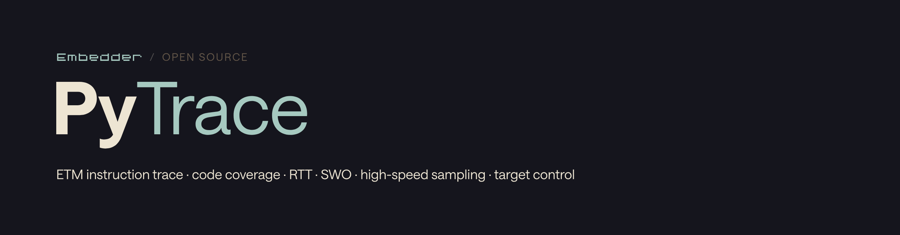

<p align="left">
  
</p>

[](https://github.com/embedder-dev/pytrace#requirements)
[](https://github.com/embedder-dev/pytrace#requirements)
[](https://github.com/embedder-dev/pytrace/blob/main/LICENSE)
[](https://github.com/embedder-dev/pytrace#install)

A Python SDK for SEGGER J-Link and J-Trace: ETM instruction trace, code
coverage, RTT, SWO, high-speed sampling and direct target control.

**No runtime dependencies, on purpose.** ELF and DWARF parsing are implemented
here rather than pulled from pyelftools, so a script can be dropped on a bench
machine and run with nothing installed but Python.

```python
from jtrace import JLink, capture_instruction_trace

with JLink(device="STM32F407VE", interface="SWD", speed_khz=4000) as jl:
    jl.reset()
    jl.halt()
    print(f"{jl.core_name()} @ {jl.target_voltage_mv()} mV")
    print(f"reset vector: {jl.read_u32(0x08000004):#010x}")

session_id, result = capture_instruction_trace(
    "firmware.elf", "STM32F407VE", duration_ms=3000
)
print(f"{result.summary.instruction_count:,} instructions, "
      f"{result.summary.frame_count:,} call frames")
```

## Requirements

- **Python 3.10+**
- **The SEGGER J-Link Software and Documentation Pack**, which supplies the
  library this SDK binds. It is a separate download under SEGGER's own licence:
  <https://www.segger.com/downloads/jlink>
- **A probe**, for anything that touches hardware. ETM instruction trace needs
  a **J-Trace** and a four-pin trace port; SWO, RTT, memory, registers,
  breakpoints and flashing work on a plain **J-Link**.

Everything that does not touch a probe — ELF and DWARF parsing, symbolization,
coverage row building, artifact writing, snapshot replay — works on a machine
with no hardware attached and no SEGGER software installed.

## Install

```bash
pip install pytrace-embedder
```

Optionally with a C++ demangler; without it the SDK falls back to `c++filt`,
and without that it reports mangled names rather than failing:

```bash
pip install "pytrace-embedder[demangle]"
```

From a checkout:

```bash
git clone https://github.com/embedder-dev/pytrace
cd pytrace && pip install -e ".[dev]"
```

The distribution is named `pytrace-embedder` -- `pytrace` on PyPI is an
unrelated function tracer -- and the import is `jtrace`. The CLI is
`python -m jtrace`, which is how every example here invokes it; installing also
puts a `pytrace-embedder` command on `PATH` as a shorthand.

The library is found automatically — the standard install locations on macOS,
Linux and Windows, then `PATH`, then the Windows registry, then an unpacked
SEGGER tarball directly under your home directory, newest first. That last one
matters on ARM Linux, where untar-and-run-in-place is the normal install and
leaves nothing in `/opt` and nothing on `PATH`. `JLINK_LIBRARY` overrides
everything, which is how you pin one version when several are installed side by
side.

## What it covers

| Area | Module | Notes |
|---|---|---|
| Connection, device, run control | `jtrace.link` | reset/halt/go/step, vector catch, halt reason |
| Memory | `jtrace.link` | byte/word/zoned/verified reads and writes |
| Registers | `jtrace.link` | queried from the DLL per device, not hardcoded |
| Breakpoints, watchpoints | `jtrace.link` | watchpoints via `SetDataEvent`, so they can also arm trace |
| Instruction trace (ETM) | `jtrace.strace` | decoded PCs, instruction statistics, selective start/stop, unlimited-length capture |
| Raw trace buffer | `jtrace.tracebuf` | offset cursor, capacity control, regions |
| SWO / ITM | `jtrace.swo` | capture plus an ITM packet decoder |
| RTT | `jtrace.rtt` | buffers, streaming, bidirectional |
| High-speed sampling | `jtrace.hss` | probe-timed memory sampling, no firmware support needed |
| Power trace | `jtrace.powertrace` | on probes that have the hardware |
| CoreSight / ETM / ETB / CP15 | `jtrace.coresight` | DP/AP transactions and macrocell registers |
| Flash | `jtrace.link` | download, erase |
| ELF + DWARF | `jtrace.elf`, `jtrace.dwarf` | sections, symbols, line table (DWARF 2–5) |
| Coverage rows, call frames | `jtrace.coverage`, `jtrace.frames` | semantics pinned to a reference implementation |
| Artifacts | `jtrace.artifacts` | writes a session a trace viewer can open |

## Driving the target

```python
from jtrace import JLink

with JLink(device="STM32F407VE", interface="SWD", speed_khz=4000) as jl:
    jl.reset()
    jl.halt()

    print(jl.register_dump())
    print(f"PC: {jl.read_register('PC'):#010x}")   # aliases work: PC, SP, LR

    handle = jl.set_breakpoint(0x08000169)
    jl.go()
    if jl.wait_for_halt(2000):
        print(f"stopped at {jl.read_register('PC'):#010x}")
    jl.clear_breakpoint(handle)
```

**Always use the context manager.** A J-Link left open wedges every later
flash, debug session and RTT connection on the machine until the process exits.
Only one probe can be open per process; a second `JLink()` raises rather than
silently stealing it.

## Capturing an instruction trace

```python
from jtrace import capture_instruction_trace

session_id, result = capture_instruction_trace(
    "firmware.elf",
    "STM32F407VE",
    duration_ms=3000,
    cpu_freq_hz=16_000_000,   # gives the timeline a time axis instead of an ordinal one
)

print(f"{result.summary.instruction_count:,} instructions in the window")
print(f"{result.summary.instructions_executed:,} executed in total")
for frame in result.frames[:10]:
    print("  " * frame.depth, frame.name, frame.end_index - frame.start_index)
```

`result.frames` is the reconstructed call stack: `name`, `depth`,
`start_index`, `end_index` (exclusive), and `open_at_start` / `open_at_end` for
frames whose entry or exit fell outside the window.

## Capturing coverage

```python
from jtrace import capture_coverage

report_path, result = capture_coverage(
    "firmware.elf", "STM32F407VE", duration_ms=5000, session_id="nightly"
)

totals = result.totals
print(f"functions:    {totals.functions_covered}/{totals.functions}")
print(f"instructions: {totals.instruction_percent:.1f}%")

for row in sorted(result.rows.functions, key=lambda r: r.run_count, reverse=True)[:5]:
    print(f"  {row.name:24} ran {row.run_count:,} times")
```

Coverage counts come from instruction statistics and cover the **whole run**,
not just the readable trace window — so coverage is complete even when the
trace itself is only the tail.

## Command line

```bash
python3 -m jtrace info                                  # library path and attached probes
python3 -m jtrace elf --elf firmware.elf                # inspect an ELF, no probe needed
python3 -m jtrace target --device STM32F407VE --registers
python3 -m jtrace trace --elf firmware.elf --device STM32F407VE --duration 3000
python3 -m jtrace coverage --elf firmware.elf --device STM32F407VE --duration 5000
python3 -m jtrace sessions                              # list stored trace sessions
python3 -m jtrace show etm-20260806-120000-a1b2
python3 -m jtrace snapshot <session>/raw/trace.jt1       # describe a capture, no ELF needed
python3 -m jtrace replay   <session>/raw/trace.jt1 firmware.elf
python3 -m jtrace rtt --device STM32F407VE --duration 10
```

Every command takes `--json`, on either side of the subcommand, which is what
makes them usable as a step in something larger. `info`, `elf`, `sessions`,
`reports`, `show`, `snapshot` and `replay` touch no hardware at all.

## Things worth knowing before you design around this

**A single trace read returns at most 65,536 instructions** — but that is not a
ceiling on capture length. Ask for more and you get it, losslessly:

```python
session_id, result = capture_instruction_trace(
    "firmware.elf", "STM32F407VE", trace_items=1_000_000, duration_ms=30_000
)
print(result.streaming.is_continuous)   # True -> no instructions were dropped
```

Above the clamp the capture runs the target in short slices and drains the
buffer each time. This works because a read *drains* (so consecutive reads
never overlap) and because below the clamp a read returns exactly as many
instructions as executed. Both are properties of the probe's buffer, checked
at runtime rather than assumed.

Whether a capture comes back lossless is clock-dependent, and the default slice
does not survive a fast core: a slow target can run a million instructions with
zero loss while the same capture on a fast one drops instructions and needs an
explicit, much shorter `slice_ms`. Check `result.streaming.is_continuous` on
each new target rather than inheriting a slice length that worked elsewhere --
[TROUBLESHOOTING.md](TROUBLESHOOTING.md) has the detail.

The cost is that the target is halted between slices, so a long capture is a
concatenation of contiguous windows rather than one uninterrupted real-time
trace. For a free-running loop that does not matter; for anything driven by an
interrupt or a timeout, it does. Always check
`result.streaming.is_continuous`.

**The artifact is the limit, not memory.** `instructions.json` grows ~170 bytes
per row, so a million rows is ~166 MB and a viewer reads it whole; captures
above ~250,000 rows warn, and are better analysed from the `CaptureResult` in
Python. In memory a million instructions is ~4 MB, because
`result.instructions` is a view that builds rows on access rather than a list
that holds them.

**What a capture keeps.** `result.store` is the program counters themselves,
segmented into one block per uninterrupted run of the core:

```python
result.store.boundaries()          # indices where instructions were actually lost
result.store.blocks[0].halt_reason # why the core stopped, raw
result.store.estimate_cycle(1234)  # None unless the capture was stamped
```

Keeping the stream is what makes a capture re-usable.
`capture_instruction_trace` writes `raw/trace.jt1` alongside the JSON — the
whole store, compressed, at around 20–30 KB per million instructions — and
`python3 -m jtrace replay <snapshot> <elf>` re-symbolizes it against any ELF,
including one that did not exist when the capture ran.

**Blocks are why gaps stop lying.** A capture longer than one probe buffer is a
sequence of run/halt slices. Where a slice overflowed, the instructions between
the two windows are gone, and a call stack reconstructed straight across that
hole reports a call or a return that never happened. The store records the loss
where it occurred, and the frame builder closes and reopens the stack there.

**A short capture's window is the tail, not the whole run.**
`summary.window_truncated` is true whenever more executed than the buffer held.
`instructions_executed` covers the whole capture; `instruction_count` is only
what was read back.

**ETM gives order, never duration.** A frame's width is work done, not time
elapsed. `cpu_freq_hz` turns indices into an estimate and nothing more.

**`ReadIntoTraceCache` is not optional.** The capture path calls it before
starting trace. Without it the DLL cannot expand ETM's branch and sync points
back into a full instruction stream, and every count afterwards is silently
wrong rather than obviously empty.

**One probe per process.** The DLL keeps its state globally, so opening a
second `JLink` while one is open raises rather than quietly stealing the probe.

See [TROUBLESHOOTING.md](TROUBLESHOOTING.md) when something does not behave.

## Where captures are written

`capture_instruction_trace` writes a session under
`<cwd>/.pytrace/traces/<session_id>/`, in the on-disk format the Embedder
trace and coverage viewer reads. Run the script from the project root, or pass
`session_root=`.

The format is that viewer's; the location deliberately is not. Those two — the
format identifier and the directory name — are the only things tying output to
a particular reader, and both are overridable. The viewer reads `.embedder`, so
writing for it means saying so:

```python
from jtrace.artifacts import write_trace_session

write_trace_session(..., store_dirname=".embedder")      # where the viewer looks
write_trace_session(..., store_dirname=".traces", trace_format="my-format-v1")
```

Everything else in `CaptureResult` — the store, the rows, the frames, the
coverage totals — is plain Python you can serialize however you like.

## Reaching past the SDK

The J-Link library exports far more than this SDK models. Everything not
modelled is still reachable:

```python
with JLink(device="STM32F407VE") as jl:
    jl.exec_command("SetResetType 3")            # any J-Link command string
    jl.raw.JLINKARM_WriteVectorCatch(0x3FF)      # any prototyped export
```

`exec_command` returns the DLL's complaint or `None`, so a rejected command is
visible rather than silent. `jtrace.loader.load()` reports what bound:
`.bound` and `.missing`.

Constants carry their provenance — `sdk` from the public headers, `observed`
where a value is not published in a header, `empirical` where it was measured
on hardware. Anything unverified says so. Treat `observed` values as specific
to the DLL versions they were checked against rather than as a stable contract.

## Tests

```bash
pip install -e ".[dev]"
python3 -m pytest tests/ -q
```

The whole suite runs on a clean checkout with no probe and no SEGGER software:
the oracle firmware it resolves addresses against is committed under
`tests/fixtures/firmware/`. A skipped test means a fixture went missing, not
that a test is optional.

Two tests are load-bearing beyond their size:

- the DWARF line table is cross-checked against **pyelftools** on every
  instruction address of the oracle firmware, so the hand-written parser is
  held to an independent implementation rather than to hand-written
  expectations;
- the capture sequence is asserted against a fake probe in **exact order**,
  because `ReadIntoTraceCache` landing after `STRACE_Start` does not fail — it
  quietly corrupts every count that follows.

The fake probe models the DLL's *measured* buffer semantics (reads drain;
retention is exact below the clamp) rather than a guess at them, which is what
makes the extended-capture tests meaningful.

## Contributing

See [CONTRIBUTING.md](CONTRIBUTING.md).

## Licence

Apache-2.0. See [LICENSE](LICENSE) and [NOTICE](NOTICE).

This project is independent and not affiliated with, endorsed by, or sponsored
by SEGGER Microcontroller GmbH. "SEGGER", "J-Link", "J-Trace" and "Ozone" are
trademarks of SEGGER Microcontroller GmbH. pytrace binds the J-Link library at
runtime and redistributes no SEGGER code, headers or binaries.
